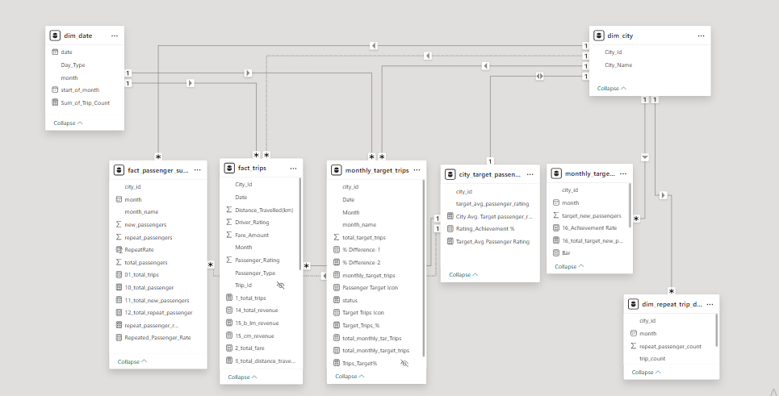
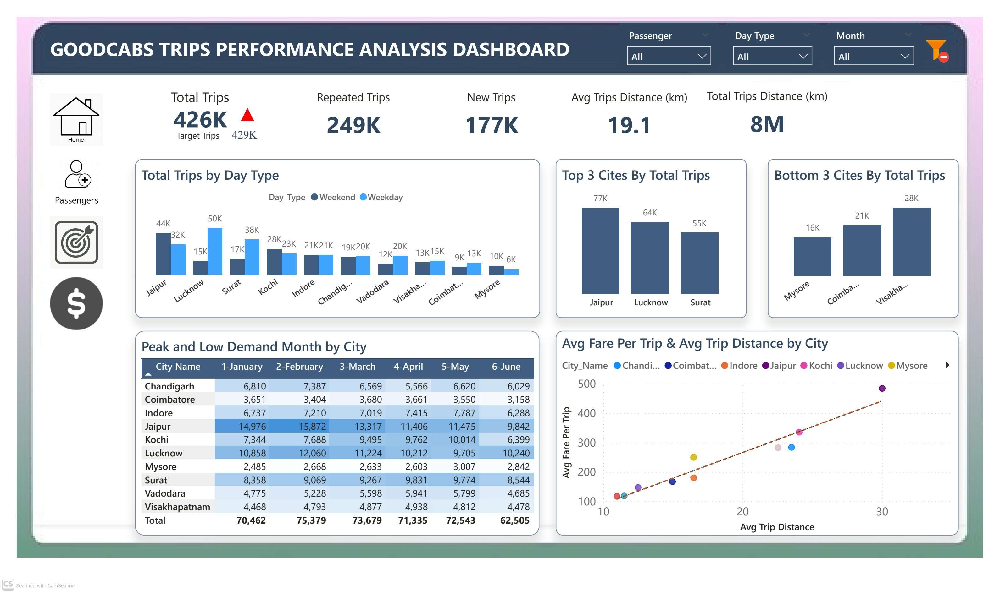
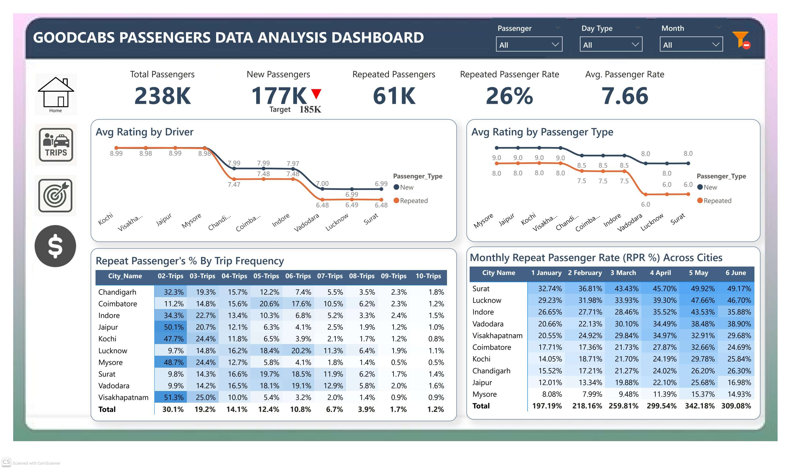
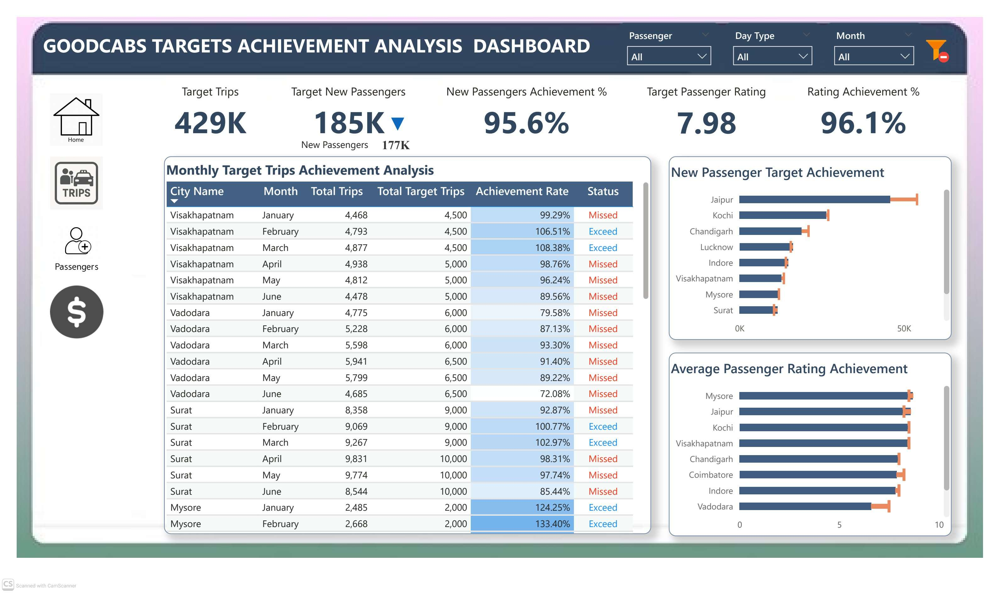
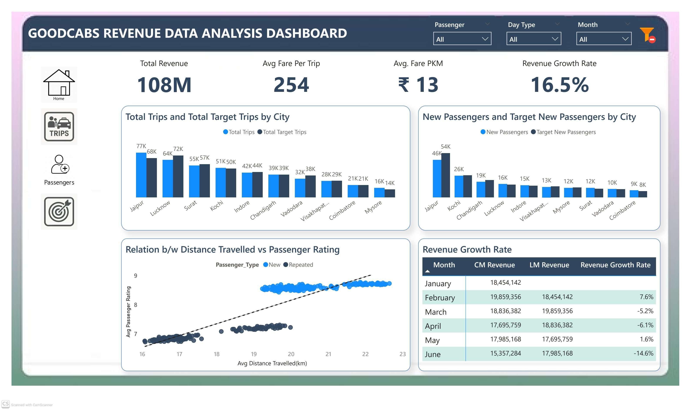

# **Goodcab Transportation & Mobility Company  Data Analysis Project (Unguided Project)** 
## Author:          Aftab Ahmad
## Date:            29 July, 2025
## Contact:         aftabajk@gmail.com

## **``Project Introduction``**:
This project analyzes the operational performance of Goodcabs, a specialized cab service provider focused on Indian **Tier-2** cities. Over a six-month period, I evaluated trip efficiency, passenger loyalty, and target achievement across 10 diverse urban markets to drive the company’s 2024 growth strategy.

## **``Business Context``**:
Established a years ago, Goodcabs differentiates itself by supporting local drivers in their hometowns while providing sustainable transit options. Operating in cities like Jaipur (Tourism) and Surat (Industrial), the company faces unique seasonal and socio-economic demand patterns.

## **``Business Problem``**
The Chief of Operations (COO) required an immediate, comprehensive performance assessment. The core challenge was identifying why certain cities consistently missed growth targets despite high overall trip volumes, and addressing a **14.6% revenue** contraction observed in June 2024.

## **``Objectives``**
- Identify top and bottom-performing cities by trip volume and revenue.
- A nalyze the Repeat Passenger Rate (RPR%) and its correlation with service quality.
- Evaluate Target vs. Actual performance for trips, new passengers, and ratings.
- Provide data-backed recommendations for fleet reallocation and pricing optimization.

### **``Stakeholders``**:
The stakeholders for this comprehensive data assessment report are as follows:
- **Bruce Haryali** Primary stakeholder requiring evidence to reallocate fleet resources and recalibrate 2025 growth targets.
- **Aftab Ahmad (Data Professional**): Responsible for transforming six months of raw operational data into a cohesive, actionable executive narrative.

## **``Data & Analytical Approach``**
- **Tools**: Power BI, and Excel, for advanced correlation analysis.
- **Methodology**: Used a Star Schema to join trip details with monthly targets. Performed variance analysis and correlation mapping between distance, fare, and satisfaction.
- **Data Source**:
The dataset has been sourced from the Codebasics website. Data for this assement analysis is open access to the public for data analysis and insight generation, making it a valuable educational resource. You can access the data [here](https://codebasics.io/challenge/codebasics-resume-project-challenge). 

## **``Data Model``**:
I engineered this Galaxy Schema to integrate multiple fact tables, such as fact_trips and monthly_target_trips, by anchoring them to shared dimensions like dim_city and dim_date. This architecture bridges disparate data granularities, enabling stakeholders to seamlessly compare daily operational performance against high-level monthly business targets within a single, unified view.

## **``Key Insights ``**:
- **The Tourism-Business Paradox**: Jaipur (77K trips) dominates volume but has low loyalty (25.7% RPR), while Surat (55K trips) has lower volume but leads the portfolio in loyalty (49.9% RPR).
- **Quality-Distance Divergence**: Repeat passengers rate long-distance trips significantly lower than new passengers, indicating a service-quality fatigue issue on high-value routes.
- **The June Slump**: A portfolio-wide **14.6% revenue drop** in June highlights a critical over-reliance on seasonal tourism demand.
- **Systemic Target Misses**: Industrial hubs **Lucknow** and **Vadodara** failed to hit a single monthly trip target, signaling a need for a re-entry or localized pricing strategy.
- **The Loyalty Peak**: Every city reached its maximum RPR% in **May**, suggesting a successful mid-year loyalty push or a seasonal shift in user behavior.
- **New Passenger Deficit**: We achieved a **95.6% rate** for new passengers, falling **8,000 users short** of the 185K strategic growth goal.
- **Efficiency Outlier**: **Mysore** maintains excellent pricing efficiency (high fare relative to distance) despite having the lowest trip volume in the portfolio.

## **``Strategic Recommendations``**:
- **Implement Tiered "Commuter Passes"**: In high-RPR cities like **Surat** and **Lucknow**, offer monthly subscriptions to lock in the daily professional base.
- **Launch "Quality Revival" in Industrial Hubs**: Specifically target **Vadodara** and **Lucknow** with driver-training programs to bridge the **~10% rating deficit** currently threatening retention.
- **Dynamic Fleet Reallocation**: Move surplus vehicles from tourism hubs to business centers during the "June Slump" to stabilize off-peak revenue.
- **Pilot EV Long-Haul Routes**: Deploy Electric Vehicles for trips over 20km in **Jaipur** and **Kochi** to improve unit margins and address declining ratings on long distances.
- **Cross-City Tourist Loyalty**: Incentivize users who travel in **Jaipur** to use Goodcabs when they return to their home cities like Indore or Chandigarh.
- **B2B Partnership Integration**: Partner with hotels in **Mysore** and trade centers in **Surat** to establish "Goodcabs Kiosks" for zero-friction booking.
- **Recalibrate H2 Targets**: Adjust benchmarks for **Lucknow** and **Vadodara** to reflect realistic market saturation while raising targets for the high-performing **Mysore** market.

## **``Expected Business Impact``**:
- **Retention**: 10–15% increase in RPR% through localized loyalty programs.
- **Revenue**: Stabilization of seasonal fluctuations, reducing the Q2 revenue dip by an estimated 5–8%.
- **Growth**: 100% target achievement in underperforming cities through recalibrated, data-driven benchmarks.

## **``Dashboard``**
The Power BI dashboard features executive-level KPI cards, interactive heatmaps for peak demand, and scatter plots illustrating the correlation between trip distance and passenger satisfaction.
**Goodcabs Trips Performance Analysis**

**Goodcabs Passenger Performance Analysis**

**Goodcabs Targets & Achievements Analysis**

**Goodcabs Revenue Performance Analysis**

## **``Conclusion``**
The analysis confirms that while Goodcabs has a strong foothold in Tier-2 cities, future success depends on transitioning from a **volume-led** to a **loyalty-led** model. By aligning operational supply with the specific "Functional DNA" of each city, Goodcabs can achieve its ambitious 2024 targets.

Thank you for taking the time to read my analysis report on Goodcab Transportation & Mobility.

I would greatly appreciate your feedback and suggestions regarding this analysis report on Goodcabs travel service. Your input is invaluable in helping me refine and improve my work. Please feel free to share your thoughts by emailing me at **aftabajk@gmail.com** or connecting with me on [LinkedIn](https://www.linkedin.com/in/aftab-ahmad-data-analyst/)

