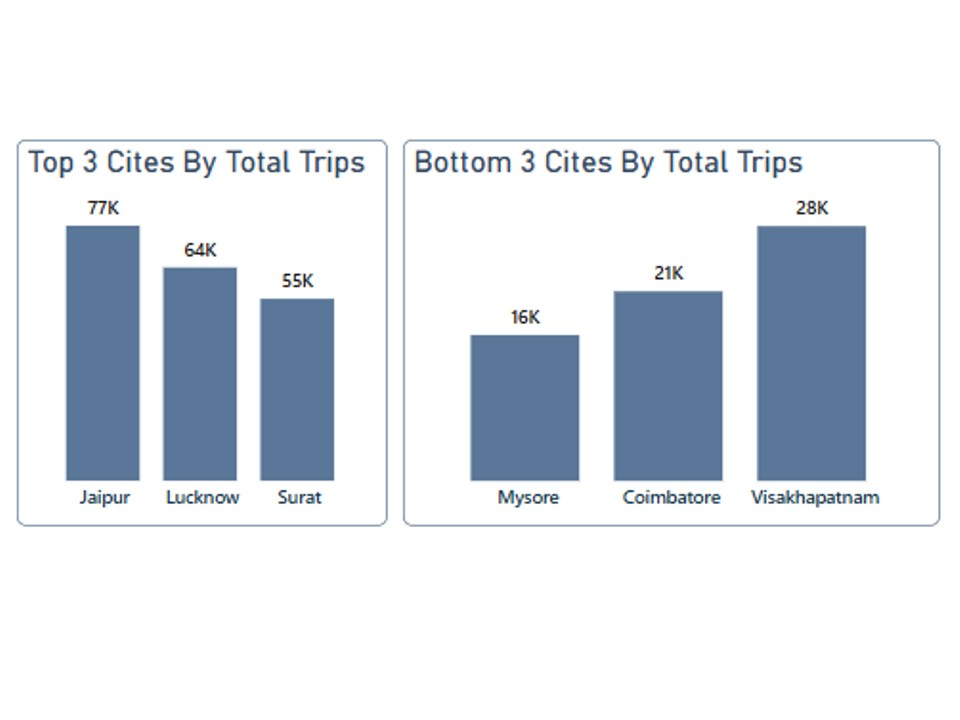
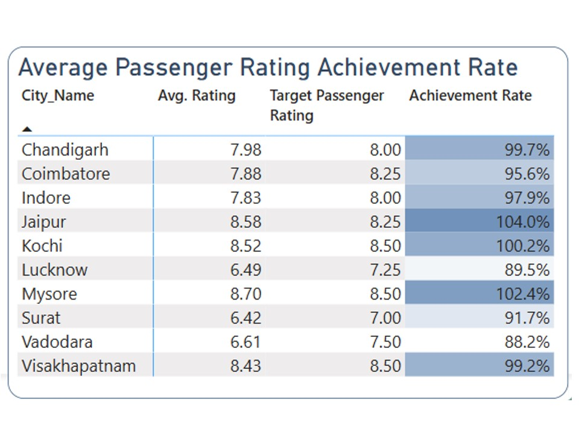

# **Goodcab Transportation & Mobility Company  Data Analysis Project (Unguided Project)** 
## Author:          Aftab Ahmad
## Date:            29 July, 2025
## Contact:         aftabajk@gmail.com

## **``Introduction``**:
**Goodcab** is a Transportation & Mobility Company established two years ago, that has gained a strong foothold in the Indian market by focusing on tier-2 cities. Goodcab is committed to supporting local drivers while ensuring excellent service to passengers accross the various cities. Goodcab has set ambitious performance targets for 2024 to drive growth and improve passenger satisfaction. 

 As part of this initiative, the Goodcabs management team aims to assess the company's performance across key metrics, In this context I conducted a comprehensive in-depth analysis of the company's performance across key metrics. To facilitate data transformation, data cleaning, data manipulation, data analysis and data visualization throughout this process, I utilized Microsoft Power BI as my primary tool.

## **``Objectives``**:
As part of this initiative, the Goodcabs management team aims to assess the company's performance across key metrics, including trip volume, passenger satisfaction, repeat passenger rate, trip distribution and the balance between new and repeat passengers. To do so, a comprehensive analysis of the Goodcabs six month data for assess the key metrics as mentioned above which are very helpful to uncover actionable insights and strategic recommendations.

### **Stakeholders**:
The stakeholders for this comprehensive data assessment report are as follows:

- **Bruce Haryali** Chief of Operation wanted this assessment report immediately , but the Analytics Manager Tony is engaged on another critical report.Tony decided to give this work to Aftab Ahmad who is the curious data analyst of Goodcabs.
- **Data Professional at Goodcabs** Aftab Ahmad is solely responsible for gathering, analyzing, and interpreting six month performance data to provide actionable insights and support the objectives of this assessment.

## **``Data Source``**:
The dataset has been sourced from the Codebasics website. Data for this assement analysis is open access to the public for data analysis and insight generation, making it a valuable educational resource. You can access the data [here](https://codebasics.io/challenge/codebasics-resume-project-challenge). 

## **``Data Description``**:
The project utilized eight CSV files:
- city_target_passenger_rating
- dim_city
- dim_date
- dim_repeat_trip_distribution
- fact_passenger_summary
- fact_trips
- monthly_target_new_passengers
- monthly_target_trips

## **``Data Cleaning``**:
I collected eight data files in comma-separated tab format. The data is efficient for meningful insights. I performed comprehensive data cleaning on the eight CSV files. Key issues identified included:
- **File Naming Inconsistency**: For example, dim_repeat_trip_distribution had a naming issue that was standardized.
- **Data Type Mismatch**: The trip_count column was stored as text, and the entries were not in ascending order. I padded trip counts with leading zeros to maintain proper order and consistency.
- **Missing/ Duplicate Values**: A thorough check was conducted to confirm there were no missing or duplicate records.
These cleaning steps ensured the dataset was reliable and analysis-ready.

## **``Data Exploration & Preparation``**:

As part of the data preparation phase, I conducted an initial exploration to assess the structure, distribution, and quality of key variables such as trip counts, fares, passenger ratings, travel dates, and repeat travel patterns. This helped ensure that the data was analysis-ready and aligned with the business questions. To enable more effective time-series analysis and improve chronological sorting, a calculated column 'month_name' was added across relevant tables, including fact_trips and monthly_target_trips. This allowed for consistent monthly trend analysis and improved the clarity of visualizations. Another key calculated metric, Repeat Passenger Rate (RPR%), was introduced to evaluate customer retention at a granular level. This derived measure played a central role in understanding passenger loyalty behavior across cities and months.

The core table, fact_trips, was enriched with detailed attributes including trip distance, fare amount, trip ratings, and temporal components (month/year). These enhancements enabled deeper exploration of passenger behavior, regional trends, and performance benchmarking across dimensions.

## **``Data Modeling``**
For this analysis, I worked with eight data tables, which provided sufficient information to carry out a comprehensive data analysis without the need for any additional sources. After developing a strong understanding of the dataset, I designed a relational data model by establishing one-to-many relationships among the relevant tables. While the data model was built using one-to-many relationships, DAX measures were created across multiple tables to align with the logical structure of the analysis. At the core of this model is the fact table, “fact_trips”, which serves as the central component for generating meaningful and actionable insights.

## **``Data Analysis``**
I conducted a comprehensive analysis using Powerbi to address the primary and secondary questions posed by the stakeholders. During this process, I identified several key insights that were instrumental in answering these critical questions.

### 1. Top and Bottom Performing Cities.

Over the six-month period, Jaipur recorded the highest number of trips among all cities, with approximately 77,000 trips, followed by Lucknow with 64,000 trips, and Surat with 55,000 trips.
In contrast, the cities with the lowest trip volumes were Mysore, registering only 16,000 trips, Coimbatore with 21,000 trips, and Visakhapatnam at 28,000 trips.

### 2. Average Fare Per Trip By City.

Stakeholders are interested in understanding how pricing efficiency, a metric that reflects the fare earned per kilometer varies across cities, particularly in relation to those with the highest and lowest average fare per trip. 

An analysis of average fare and trip distance reveals that Jaipur ranks highest, with an average fare of ₹484 and an average distance of 30.02 km per trip. It is followed by Kochi, with an average fare of ₹335 and a distance of 24.07 km, and Chandigarh, which stands third with ₹284 fare and 23.52 km distance per trip.

While several cities show competitive performance, the key differentiator is pricing efficiency (a metric that reflects fare earned per kilometer.) In this context, Jaipur again leads with a pricing efficiency of 16.1%, followed by Mysore at 15.1% and Kochi at 13.9%. Other notable cities include:

- Visakhapatnam – 12.5%
- Lucknow – 11.8%
- Coimbatore – 11.1%
- Surat – 11.0%
- Indore – 10.9%

This analysis highlights that Jaipur, Mysore, and Kochi are the top-performing locations in terms of pricing efficiency, indicating stronger revenue generation per kilometer and more optimized pricing strategies.

### 3.  Average Ratings by City and Passenger Type.

An analysis of passenger ratings across cities indicates that **Mysore, Jaipur, Kochi,** and **Visakhapatnam** consistently receive higher average ratings from both new and repeated passengers, reflecting strong service satisfaction in these locations.

In contrast, cities such as **Surat, Lucknow, and Vadodara** show the lowest average ratings across both passenger segments, highlighting areas that may require service quality improvements.

These insights emphasize a clear distinction in passenger experience levels across regions, with **Kochi, Visakhapatnam, Jaipur,** and **Mysore** standing out as high-performing cities in terms of customer satisfaction.

An analysis of driver-assigned passenger ratings reveals similar regional trends to passenger feedback. Cities like Kochi, Visakhapatnam, Jaipur, and Mysore stand out with consistently higher average ratings given by drivers to both new and repeat passengers. This suggests that passengers in these cities demonstrate respectful behavior, punctuality, and overall positive interactions, contributing to smoother ride experiences.

In contrast, Surat, Lucknow, and Vadodara recorded the lowest average passenger ratings from drivers across both segments, signaling potential concerns related to passenger conduct or engagement that may warrant further review or targeted service initiatives.

### 4. Peak and Low Demand Months by City.  

To better understand seasonal patterns and optimize resource allocation, stakeholders requested an analysis of peak and low demand periods across cities. The data reveals that February recorded the highest number of trips at 75,379, followed closely by March with 73,679 trips, May with 72,543, April with 71,335, and January with 70,462 trips. The lowest demand was observed in June, with 62,505 trips.

At the city level, Jaipur emerged as the top-performing location, with 76,888 trips, followed by Lucknow with 64,299 trips, and Surat in third place with 54,843 trips. On the lower end, Mysore and Coimbatore recorded the fewest trips, with 16,238 and 21,104, respectively.

These insights highlight clear seasonal demand trends and regional disparities, enabling more informed decisions around capacity planning, marketing efforts, and operational adjustments.

### 5. Weekend vs. Weekday Trip Demand by City.

To understand demand variation and support operational planning, stakeholders requested insights into city-wise preferences for weekend vs. weekday trips.

The data shows that Jaipur exhibits a strong preference for weekend travel, recording 44,000 trips on weekends compared to 32,000 on weekdays. In contrast, Lucknow displays the opposite trend, with a significant weekday preference—50,000 trips on weekdays versus 15,000 on weekends. Surat ranks third in overall demand, with 17,000 weekend trips and 38,000 weekday trips.

Focusing specifically on weekend travel:

- **Jaipur** leads with the highest weekend trip volume (44K),
- **Kochi** (28K)
- **Indore** (21K)
Other cities like **Chandigarh** and **Surat** also demonstrate a higher demand on weekends.

**For weekday travel**:

- Lucknow ranks first,followed by **Surat** and **Jaipur**.
While some cities show stronger weekend demand, the overall trend across all cities indicates a higher preference for weekday trips.

### 6.  Repeat Passenge Frequency and City Contribution Analysis.

Repeat passenger trends show the highest frequency in 2-trip journeys (30.06%), followed by 3-trips (19.17%), gradually declining to 10-trips (1.20%).

Tourism-driven cities lead in repeat travel:
- **Visakhapatnam**, the largest city in Andhra Pradesh, shows the highest engagement with 51.25% in 2-trips and 24.96% in 3-trips.
- **Jaipur**, a UNESCO World Heritage Site, and Mysore, known for its palace and Dasara festival, also record high 2- and 3-trip rates.
- **Kochi**, Kerala’s commercial hub with rich cultural attractions, shows stronger 3-trip engagement (24.35%) despite lower 2-trip counts.
- 
Cities with industrial and commercial focus report lower repeat travel:
- **Surat**, **Indore**,**Vadodara**, **Coimbatore**, and **Lucknow** show less frequent repeat usage, reflecting more one-time or business-centric travel patterns.

### 7.  Monthly Target Achievement Analysis for Key Metrics.

#### Trip target achievement varied notably across cities:
- Jaipur and Mysore achieved 100% of their targets, reflecting strong demand. Jaipur, a key tourist hub and UNESCO World Heritage Site, and Mysore, famous for its palace and Dasara celebrations, continue to attract high visitor interest.
- Kochi and Coimbatore reached 67%. While Kochi is Kerala’s largest metropolitan and a cultural-tourism blend, Coimbatore remains an industrial center with moderate engagement.
- Indore and Chandigarh met 50% of their targets. Both cities offer a mix of business and tourism but showed mid-level performance.
- Visakhapatnam and Surat achieved 33%, despite being among the largest metropolitan and commercial hubs in their regions.
- Lucknow and Vadodara recorded 0%, indicating a mismatch between projected demand and actual engagement.

**Tourism-driven** cities like J**Jaipur**, **Mysore**, and **Kochi** generally outperformed, driven by consistent interest and higher repeat travel.
In contrast, **business-oriented** cities such as **Surat**, **Indore**, **Coimbatore**, and **Vadodara** underperformed, possibly due to more transactional travel and lower repeat frequency.
These insights can guide future marketing, demand planning, and resource allocation aligned with each city's travel behavior.

#### New Passenger Target Achievement Analysis

The analysis of new passenger target achievement highlights varied performance across cities:

- Coimbatore, Surat, Indore, Lucknow, and Vadodara successfully achieved 100% of their new passenger targets, with Coimbatore leading the performance group.

- On the other hand, Chandigarh, Mysore, Visakhapatnam, and Jaipur fell below the 100% target mark, with Jaipur recording the lowest achievement rate among all cities analyzed.

This performance trend also reflects the nature of city profiles:
- **Tourism-focused** cities such as Jaipur, Kochi, and Mysore showed relatively lower achievement rates, indicating potential seasonal dependencies or inconsistent new passenger inflows.

In contrast, **business- and industry-centric** cities like Indore, Chandigarh, Lucknow, Surat, and Vadodara performed strongly, consistently meeting or exceeding their targets, likely due to more regular and necessity-driven travel behavior.

These insights provide a clearer understanding of how different city profiles influence new passenger acquisition, helping inform more targeted strategies for growth and engagement.

#### Passenger Rating Target Achievement Analysis

Among the cities, Jaipur, Mysore, and Kochi successfully met their passenger rating targets, reflecting strong service quality.
Meanwhile, Vadodara, Surat, Lucknow, Indore, Coimbatore, Visakhapatnam, and Chandigarh fell short of their targets.
Notably, **tourism-focused** cities like Jaipur, Kochi, and Mysore outperformed, while **business-centric** cities such as Indore, Chandigarh, Lucknow, Surat, and Vadodara underachieved, highlighting the impact of city profiles on passenger satisfaction.

### 8. Highest and Lowest Repeat Passenger Rate (RPR%) by City and Month;

An analysis of the Repeat Passenger Rate (RPR%) reveals significant variation across cities and months:
- Among cities, Surat recorded the highest RPR at 257.78%, followed by Lucknow at 228.79%, indicating strong customer retention.
- In contrast, Mysore had the lowest RPR at 67.25%, with Jaipur following at 109.98%, suggesting weaker repeat engagement.

At the monthly level:
- May had the highest RPR at 342.54%, followed by June (309.08%), April (299.18%), and March (259.81%).
- February recorded 218.16%, while January had the lowest rate at 197.19%.

These trends indicate that repeat travel peaks during the summer months, likely driven by seasonal demand, holidays, and increased intercity movement.

### 9. Factors Influencing Repeat Passenger Rates;

several factors contribute to higher or lower Repeat Passenger Rates (RPR%) across cities, with clear correlations to service quality, pricing efficiency, city demographics, and lifestyle or socioeconomic patterns.

##### Quality of Service
- Cities like Jaipur, Mysore, Kochi, and Visakhapatnam received higher average passenger ratings, indicating strong service satisfaction.
- These same cities also show higher repeat trip frequencies (2–3 trips) and stronger pricing efficiency (Jaipur: 16.1%, Mysore: 15.1%, Kochi: 13.9%), suggesting that satisfied passengers are more likely to return. 
**Correlation**: High service quality → Higher repeat travel.

#### Pricing Efficiency
- aipur, Mysore, and Kochi lead in pricing efficiency, which reflects value for money (fare per km).
- These cities also align with higher customer satisfaction and repeat trip frequencies, indicating that competitive pricing paired with quality contributes to loyalty.
**Correlation**: Optimized fare structures → Better retention.

#### Socioeconomic & Lifestyle Patterns
- Cities like Surat and Lucknow show high repeat rates despite low service ratings, suggesting necessity outweighs experience for some commuters.
- High RPR% in these cities aligns with their roles as commercial or administrative centers, where employment, trade, and services drive regular mobility.
- Conversely, Mysore and Jaipur—though tourism-heavy and well-rated—show lower repeat engagement, which could be explained by:
o	Leisure-focused, one-time visitor behavior.
o	Less frequent need-based travel.

**Insight**: Economic purpose and commuter lifestyle play a major role in repeat behavior, often more than satisfaction alone.

### 10. Tourism vs. Business Demand Impact

Tourism seasons and local events like festivals (e.g., Mysore Dasara) and peak travel months (e.g., February to May) significantly impact Goodcabs demand in tourism-oriented cities such as Jaipur, Mysore, and Kochi. These cities show:
- High weekend trip volumes (e.g., Jaipur: 44K weekend trips),
- Strong performance in trip targets and ratings, but
- Lower new passenger acquisition and RPR%, suggesting seasonal dependency.

Tailoring marketing efforts around festivals and tourism seasons would likely boost trip volumes, attract more new passengers, and enhance repeat engagement in these cities. This approach aligns demand with local travel peaks and improves ROI on promotional spend.

### 11. Emerging Mobility Trends and Goodcabs' Adaption

Goodcabs should consider integrating EVs and eco-friendly initiatives in tier-2 cities. Cities like Kochi (with India’s first water metro) show readiness for green mobility, while tourism-heavy cities like Jaipur and Mysore have strong demand and sustainability potential. This move can boost brand image, attract eco-conscious travelers, and align with emerging urban mobility trends.

### 12. Partnership Opportunities with Local Business

Goodcabs can boost demand and loyalty by partnering with hotels, malls, and event venues especially in tourism-heavy cities like Jaipur, Mysore, and Kochi, which show high trip volumes and strong weekend/repeat travel patterns. These partnerships can capture foot traffic, enhance convenience, and encourage repeat usage, particularly during peak seasons and local events.

### 13. Data Collection for Enhanced Data-Driven Decisions

To enhance performance, Goodcabs should collect additional data on:

- Customer Demographics & Purpose of Travel (e.g., business, tourism)  to tailor services and promotions.
- Trip Timing & Booking Channels to understand peak hours, spontaneous vs. planned trips.
- Driver Performance & Route Efficiency to optimize service quality and travel time.
- Event & Seasonal Demand Data to align supply with festivals, holidays, or conferences.
- Customer Feedback (post-ride surveys) to pinpoint satisfaction drivers and pain points.
- Competitor Pricing & Market Share Trends to stay competitive in local markets.
This data will help refine targeting, boost loyalty, and improve city-specific strategies.

###  **Additional Insight**: Correlation Analysis
#### Positive Correlation Between Distance Travelled & Passenger Rating;

During the analysis, a positive correlation was observed between the distance travelled and the passenger rating. This suggests that passengers who take longer trips tend to provide higher ratings.
**Possible Interpretation:**
- Longer journeys may offer more opportunity for positive service experiences, such as comfort, driver professionalism, or smooth route handling.
- Passengers on short trips might be more sensitive to minor issues like delays or navigation errors.

## **``Summary of Analysis``**:

#### Top Performing Cities by Trip Volume:
- Jaipur (77K), Lucknow (64K), and Surat (55K) led in overall trip volume.
- Mysore, Coimbatore, and Visakhapatnam recorded the lowest volumes.

#### Pricing Efficiency Insights:
- Jaipur (16.1%), Mysore (15.1%), and Kochi (13.9%) ranked highest in fare per kilometer.
- Strong pricing efficiency indicates optimized pricing and better revenue per trip.

#### Average Fare and Distance Trends:
- Jaipur had the highest fare (₹484) and longest average trip distance (30.02 km).
- Kochi and Chandigarh also performed well in terms of fare and distance per trip.

#### Customer Satisfaction (Ratings):
- Cities with consistently high ratings: Mysore, Jaipur, Kochi, and Visakhapatnam.
- Low-rating cities: Surat, Lucknow, and Vadodara — potential areas for service improvement.

#### Seasonal Demand Patterns:
- Highest demand in February, followed by March and May.
- June had the lowest trip volume, indicating off-peak season.

#### Weekend vs. Weekday Travel Trends:
- Jaipur and Kochi showed strong weekend demand.
- Lucknow and Surat had higher weekday demand, aligning with business travel patterns.

#### Repeat Passenger Behavior:
- Tourism-heavy cities like Visakhapatnam, Jaipur, and Mysore saw higher 2–3 trip repeats.
- Business-centric cities like Surat, Indore, and Lucknow had lower repeat usage.

#### Trip Target Achievement:
- Jaipur and Mysore met 100% of their trip targets; Coimbatore and Kochi reached 67%.
- Lucknow and Vadodara did not meet any trip targets.

#### New Passenger Target Achievement:
- Coimbatore, Surat, Indore, Lucknow, and Vadodara achieved 100% of new passenger goals.
- Jaipur had the lowest new passenger achievement, possibly due to seasonal variation.

#### Passenger Rating Target Achievement:
- Jaipur, Mysore, and Kochi met their passenger satisfaction goals.
- Business-focused cities underperformed in customer ratings.

#### Repeat Passenger Rate (RPR%) Trends:
- Highest RPR cities: Surat (257.8%), Lucknow (228.8%).
- Lowest RPR cities: Mysore (67.3%), Jaipur (109.9%).
- May and June had the highest RPRs, reflecting peak travel periods.

#### Positive Correlation Impact:
- Positive correlation can help Goodcab focus on enhancing short-trip experiences and maintaining service quality across all trip lengths.

## **``Dashboard Insights``**:

### Trips Analysis.

### Passengers Analysis.

### Target Insights.

### Revenue Insights.

## **``Recommendation``**:

#### Leverage High-Performing Cities for Marketing Campaigns
- Capitalize on cities like Jaipur, Mysore, and Kochi, which have high trip volumes, repeat rates, and passenger satisfaction.
- Launch localized promotions and referral programs to boost both new and repeat passenger acquisition.

#### Improve Service Quality in Low-Rating Cities
- Cities such as Surat, Lucknow, and Vadodara show consistently low passenger ratings.
- Conduct service quality audits, enhance driver training, and integrate feedback loops to improve customer experience.

##### Align Resource Allocation with Seasonal Trends
- Increase vehicle availability and staffing during high-demand months (Feb–May), especially in tourism-driven cities.
- Adjust fleet deployment and marketing efforts based on weekday/weekend demand preferences per city.

#### Target Repeat Engagement in Underperforming Cities
- Despite high RPR in cities like Surat and Lucknow, their trip target achievement was low.
- Explore partnerships with hotels, events, and local businesses to stimulate demand and enhance repeat usage.

##### Optimize Pricing Strategy Based on Efficiency Metrics
- Use insights from pricing efficiency leaders (Jaipur, Mysore, Kochi) to reevaluate fare models in low-efficiency cities.
- Introduce dynamic pricing or city-specific offers to boost profitability and competitiveness.

## **``Conclusion``**:
The analysis reveals a strong performance by tourism-centric cities like Jaipur, Mysore, and Kochi, which consistently lead in trip volume, pricing efficiency, passenger satisfaction, and repeat engagement. In contrast, business-focused cities such as Surat, Lucknow, and Vadodara underperform in several key areas, particularly in service quality and trip target achievement.

Seasonal and weekday/weekend trends further emphasize the importance of localized strategy and dynamic resource allocation. Despite high repeat passenger rates in some underperforming cities, demand and new passenger acquisition remain inconsistent, highlighting gaps in engagement and marketing alignment.

To sustain growth and improve across regions, Goodcabs must adopt a data-driven, city-specific approach, focusing on service enhancement, strategic partnerships, and operational agility. By doing so, the company can effectively boost demand, improve customer retention, and optimize profitability across diverse market profiles.

Thank you for taking the time to read my analysis report on AtliQ Motors.

I would greatly appreciate your feedback and suggestions regarding this analysis report on Goodcabs travel service. Your input is invaluable in helping me refine and improve my work. Please feel free to share your thoughts by emailing me at **aftabajk@gmail.com** or connecting with me on [LinkedIn](https://www.linkedin.com/in/aftab-ahmad-data-analyst/)

